# Launcherg 利用ガイド

Launcherg は、**「エロゲー批評空間」に登録されているノベルゲーム専用**のランチャーアプリケーションです。
このアプリは ryoha000 さんのオリジナルリポジトリ [Launcherg](https://github.com/ryoha000/launcherg) をクローンし、独自に改造したものです。
散らばりがちなゲームを一元管理し、プレイ時間を自動的に記録することができます。

> [!IMPORTANT]
> 本アプリケーションは「エロゲー批評空間」のデータを基に動作するため、同サイトに登録されていないゲームは正しく追加・管理できない場合があります。
> ※「エロゲー批評空間」には、**18禁ゲーム以外の一般向けノベルゲームも多数登録されています**ので、それらも問題なく管理可能です。

## 目次

1. [はじめに](#はじめに)
2. [ダウンロードとインストール](#ダウンロードとインストール)
3. [ゲームの登録と管理](#ゲームの登録と管理)
4. [ゲームのプレイと記録](#ゲームのプレイと記録)
5. [設定](#設定)
6. [スクリーンショット管理](#スクリーンショット管理)
7. [トレイアイコン機能](#トレイアイコン機能)

## はじめに

Launchergを使用することで、PCにインストールされたノベルゲームを管理し、プレイ時間を記録したり、スクリーンショットを整理したりすることができます。

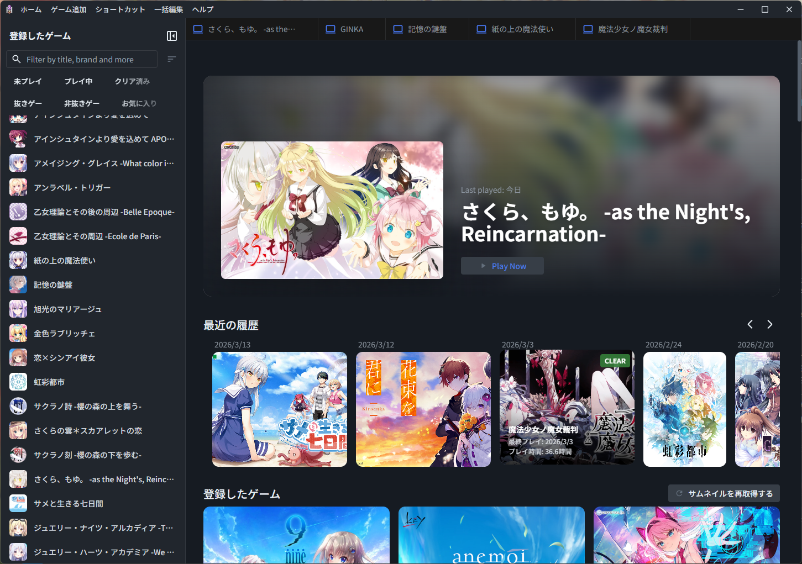
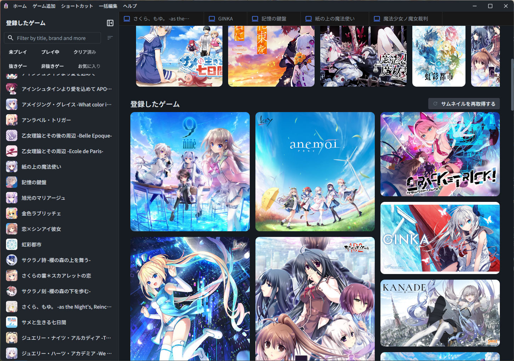
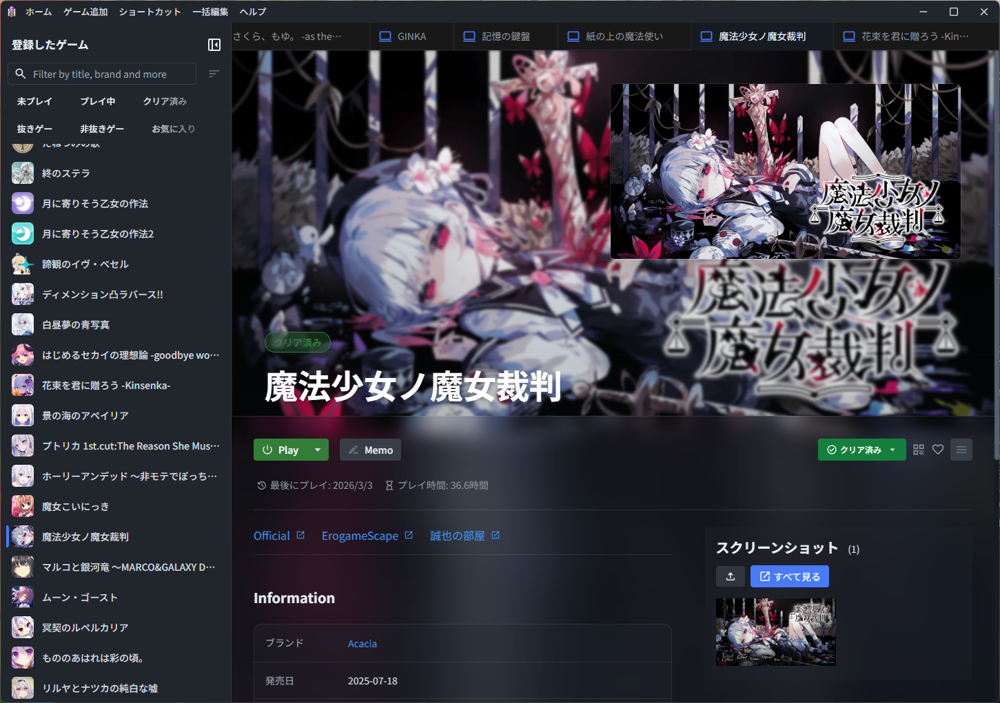

## ダウンロードとインストール

Launcherg-Mod は GitHub の Releases ページからダウンロードできます。

1. **Releases ページを開く**
   [GitHub Releases](https://github.com/nnnSMM/Launcherg-Mod/releases) にアクセスします。
2. **ZIPファイルのダウンロード**
   最新バージョンの Assets の中から、Windows用のZIPファイル（例: `Launcherg-Mod_YYYYMMDD_x64_ja-JP.zip`）をダウンロードします。
3. **インストールと起動**
   ダウンロードしたZIPファイルを任意のフォルダに展開（解凍）し、中にあるインストーラー（例: `Launcherg-Mod_YYYYMMDD_x64_ja-JP.msi`）をダブルクリックして、画面の指示に従ってインストールを完了してください。

> [!NOTE]
> 初回起動時などにWindowsのSmartScreenに関する警告が表示される場合がありますが、「詳細情報」をクリックしてから「実行」を選択することでインストールおよび起動を続行できます。

## ゲームの登録と管理

### ゲームの追加

Launchergにゲームを追加するには、画面左上の「ゲーム追加」をクリックします。以下の方法でゲームを追加できます。

1.  **ファイルを選択**: ゲームの実行ファイル（.exe）やショートカットファイル（.lnk）をダイアログから選択して追加します。

    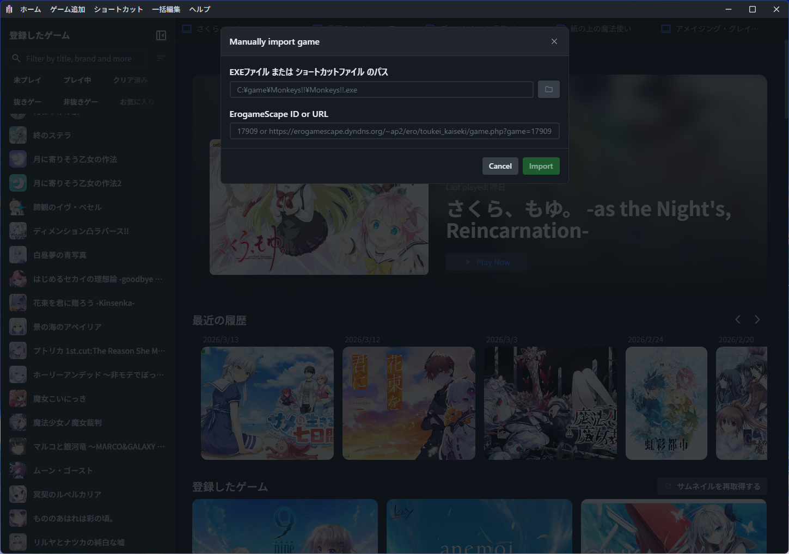

2.  **自動スキャン**: 指定したフォルダ内をスキャンし、登録可能なゲームを自動的に検出して追加します。

    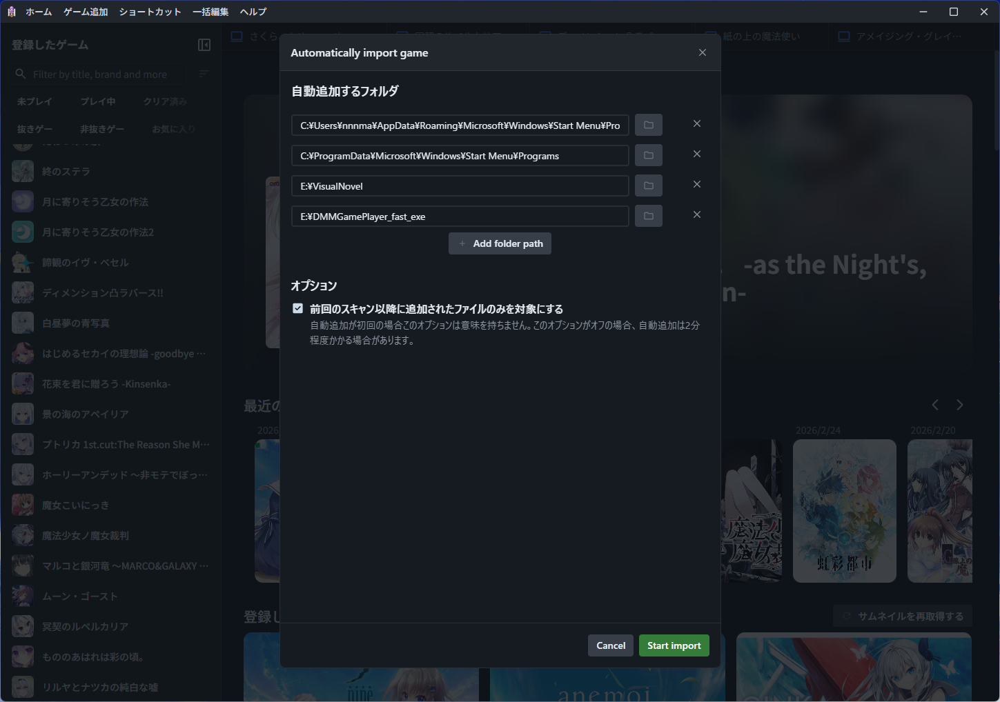

3.  **ドラッグ＆ドロップ**: ゲームの実行ファイルやショートカットファイルをメインウィンドウに直接ドラッグ＆ドロップして追加します。

### ゲーム詳細の編集

*   **サムネイルの変更**: ゲームのカードを右クリックすることで、サムネイル画像を変更できます。
*   **メモの作成**: ゲーム詳細画面の「Memo」ボタンから、そのゲームに関するメモ（攻略情報や感想など）をMarkdown形式で記録できます。

    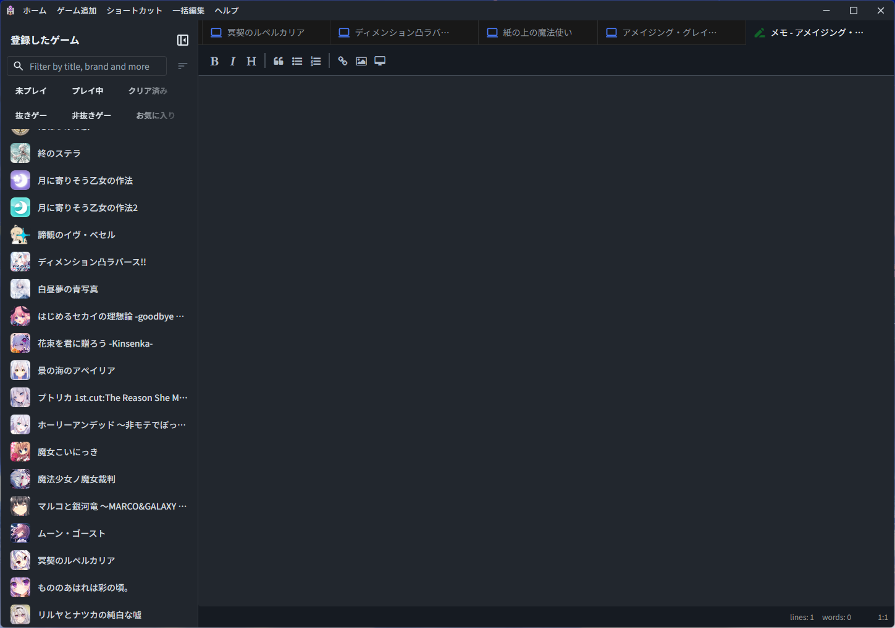

### ゲームの削除

登録したゲームを削除するには、ゲーム詳細画面のメニューボタン（三本線のアイコン）をクリックし、削除オプションを選択します。削除には以下の2つのモードがあります。

1.  **未インストール状態にする**:
    *   Launcherg上の起動パス設定のみを解除します。
    *   **データは保持されます**: プレイ履歴、スクリーンショット、メモなどは残るため、後でパスを再設定すれば続きから記録できます。
    *   **活用例**: PCの容量不足などで一時的にゲームをアンインストールする場合に便利です。Launcherg上では「未インストール（起動不可）」として残るため、どのゲームを退避させたかがひと目で分かります。

2.  **完全削除**:
    *   Launchergからゲーム情報を完全に削除します。
    *   **データも削除されます**: アイコン、サムネイル、スクリーンショット、プレイ履歴などの関連ファイルが**全て削除**されます。
    *   ※PC上のゲーム本体ファイル（インストールフォルダ）は削除されません。

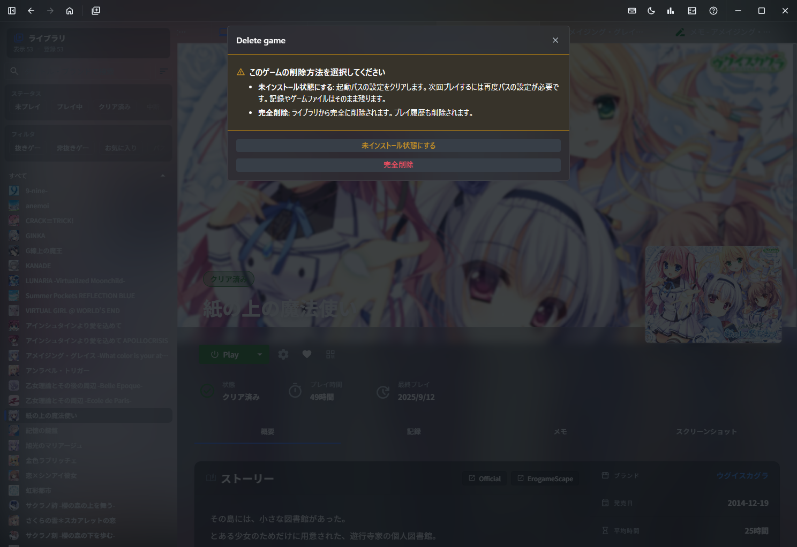

### ゲームのパス設定と再リンク

ゲームのフォルダを移動したり、ドライブ構成が変わったりして起動できなくなった場合は、以下の方法でパスを再設定できます。

1.  **設定メニューから**: ゲーム詳細画面の右上にあるメニューボタン（三本線のアイコン）から「ゲームの場所を変更」を選択し、新しい実行ファイルを指定します。
2.  **「パスを設定」ボタンから**: ゲームを「未インストール状態」にすると、通常「Play」ボタンが表示される場所が黄色の「パスを設定」ボタンに変わります。これをクリックすることでも再設定が可能です。

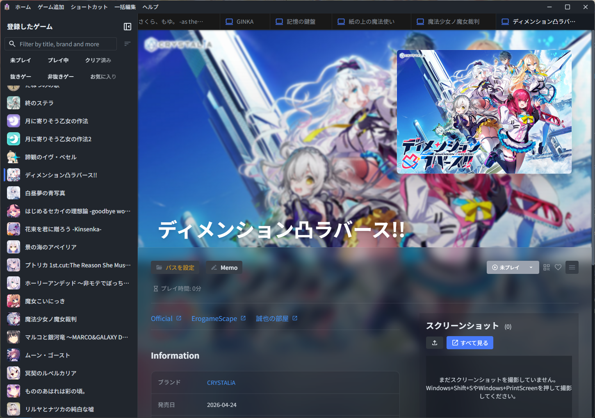

## ゲームのプレイと記録

### ゲームの起動

*   **個別ゲームページから**: 各ゲームの詳細ページにある「Play」ボタンを押すとゲームが起動します。
*   **ショートカットキーから**: 設定済みのショートカットキーを使って、特定のゲームを即座に起動できます（後述）。

### プレイ時間の記録

Launchergは、ゲームのプロセスが実行されている間、プレイ時間をカウントします。

### 計測の一時停止

ゲームを起動したまま離席する場合など、プレイ時間の計測を一時停止したいときは以下の方法が使えます。

1.  **ショートカットキー**: 設定した「Pause用ショートカットキー」を押します。
2.  **オーバーレイ**: 一時停止中は画面全体にオーバーレイが表示され、計測が停止していることがわかります。再開するには画面をクリックするか、再度ショートカットキーを押します。

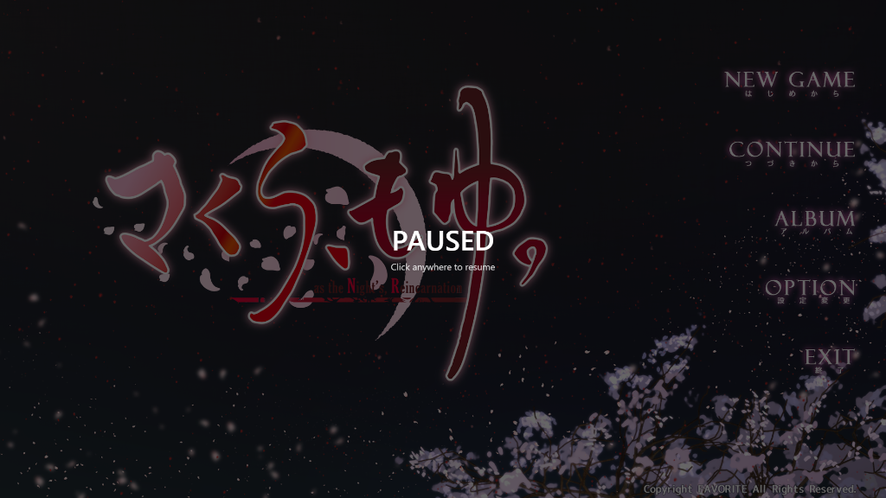

## 設定

画面左上の各メニューから、設定機能にアクセスできます。

### ショートカット

画面左上の「ショートカット」をクリックしてアクセスできます。ゲーム起動用およびPause用のショートカットキーを割り当てます。

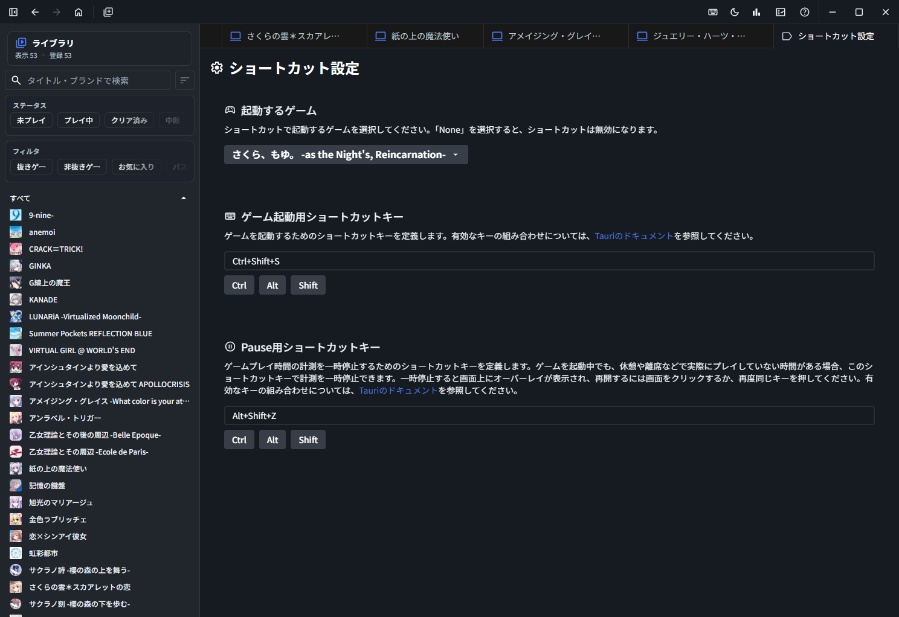

Launchergは、ウィンドウが非アクティブな状態でも動作するグローバルショートカットを提供しています。

#### ゲーム起動用ショートカット

*   現在プレイ中のゲームなどを登録しておくと、PCを起動した後すぐにそのゲームを開くことができて便利です。
*   **登録方法**: 各ゲームの詳細ページにある「このゲームをショートカットに設定」ボタンを押すか、この設定画面から登録します。
*   **起動**: 設定したショートカットキーを押すだけで、登録したゲームが起動します。

#### Pause用ショートカット

*   プレイ時間の計測を一時停止/再開するためのショートカットキーです。

### 一括編集（プレイ状況）

画面左上の「一括編集」をクリックしてアクセスできます。登録されているすべてのゲームのプレイ状況（クリア済み、プレイ中など）を一括で管理・編集できます。

*   **一括選択操作**: 画面上部のアイコンボタンから「表示されている全ゲームを選択」「全選択解除」「選択状態の反転」をワンクリックで行えます。
*   **表示の絞り込み**: ツールバー内の「表示の絞り込み」ボタンを使用し、現在のプレイ状況（未プレイ、プレイ中、クリア済み）で即座に表示をフィルタリング可能です。

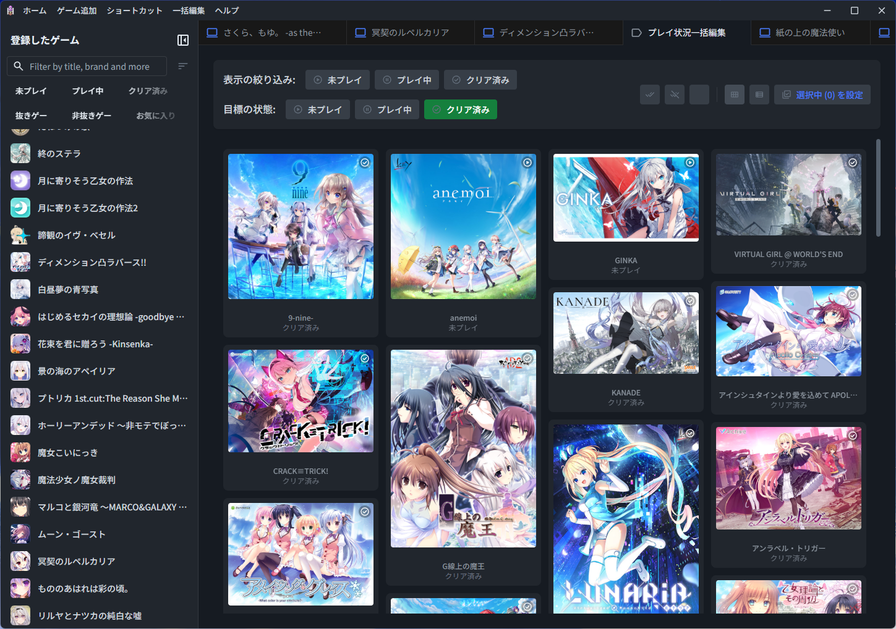

## スクリーンショット管理

Launchergはゲームプレイ中のスクリーンショットを管理する機能を持っています。
**本アプリはWindows標準のスクリーンショット機能を利用します。**

### スクリーンショットの撮影方法

1.  ゲームプレイ中に、キーボードの **`Windows` + `Shift` + `S`** キーを押して、スクリーンショットを撮影します（Snipping Tool）。
2.  撮影された画像が `ピクチャ > スクリーンショット` フォルダに保存されると、Launchergがそれを自動的に検出し、プレイ中のゲームに関連付けて取り込みます。
    *   ※ **`Windows` + `PrintScreen`** キーでの撮影にも対応しています。

> [!TIP]
> **「ウィンドウの領域切り取り」の活用**
> Snipping Tool（`Win + Shift + S`）を起動した際、画面上部にある「切り取り領域」の部分をクリックして「ウィンドウ」という選択肢を選び、ターゲットとなるゲームのウィンドウをクリックすると、余計な背景を含まずにゲーム画面だけを綺麗にキャプチャできるため大変便利です。

### スクリーンショットの閲覧と整理

*   各ゲームの詳細ページ（右カラム）には、そのゲームの**最新のスクリーンショットがプレビュー表示**されます。
*   **別ウィンドウでの閲覧と管理**: 「すべて見る」ボタン、またはプレビュー画像をクリックすると、**専用の独立した別ウィンドウ**が起動します。ここからフルサイズでの画像閲覧や、ゲームを跨いだスクリーンショットの一覧表示が可能です。
*   **一括削除機能**: 別ウィンドウ内のツールバーにある「選択」ボタンを押すと、複数選択モードに切り替わります。不要なスクリーンショットを複数選び、まとめて一括削除することができます。

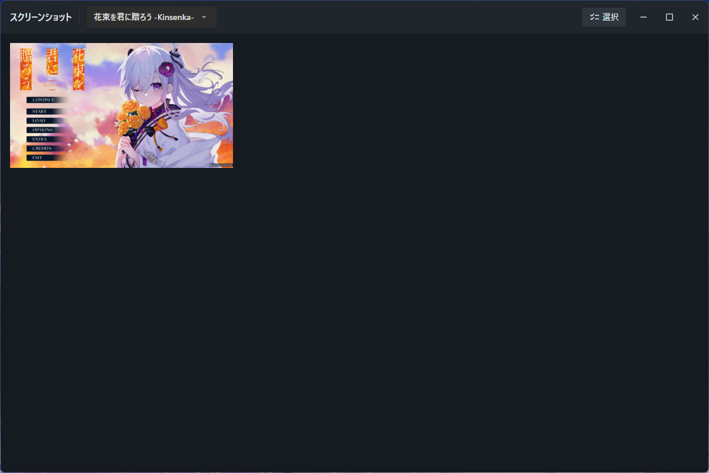
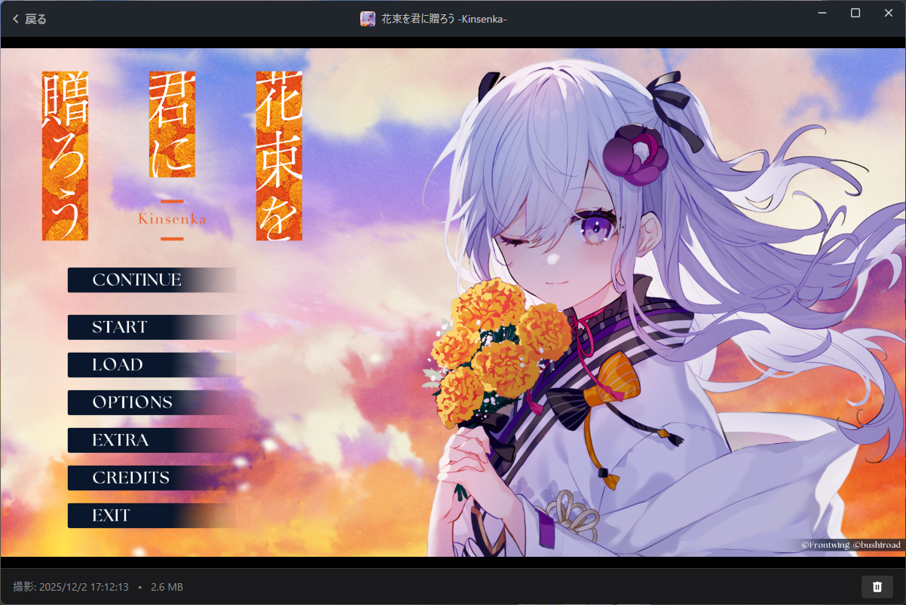

### 画像のインポート

*   外部で撮影したスクリーンショットや関連画像は、ファイル選択ダイアログから取り込むことができます。

### 整理と削除

*   不要なスクリーンショットはアプリ内から削除可能です。

## トレイアイコン機能

Launchergはタスクトレイ（システムトレイ）に常駐します。以下の操作が可能です。

- **右クリック**: トレイメニューを即時表示します
- **左クリック**: 少し遅延後にトレイメニューを表示します  
- **左ダブルクリック**: トレイメニューを表示せず、メインウィンドウのみを開きます

トレイメニューから以下の操作が可能です。

*   **ウィンドウの表示**: メインウィンドウを開きます。
*   **ショートカットゲームの起動**: 設定したショートカットゲームを直接起動できます。
*   **最近プレイしたゲーム**: 最近遊んだゲームのリストが表示され、そこから直接起動できます。
*   **終了**: アプリケーションを完全に終了します。

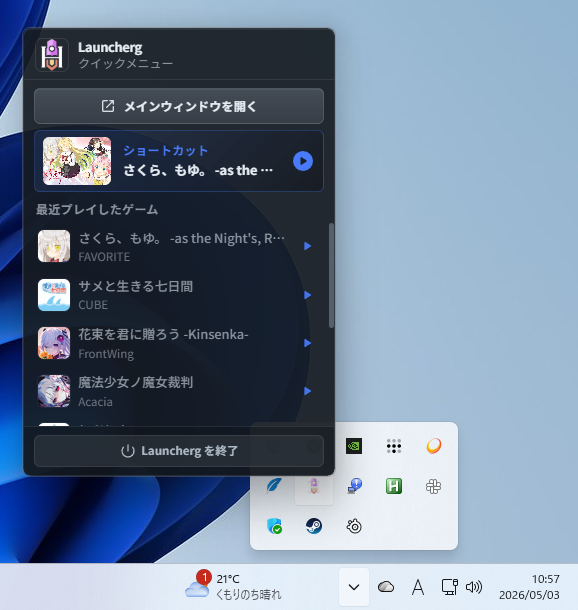

## 免責事項

本ガイドに含まれるスクリーンショット内のゲーム画像やアートワークの著作権は、それぞれの制作会社および権利者に帰属します。これらは本アプリケーションの機能を説明するためにのみ使用されており、権利の侵害を意図するものではありません。
