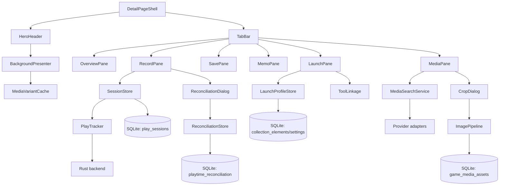
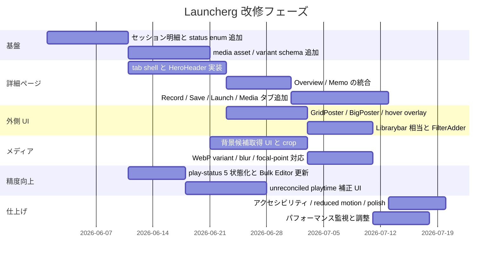

# Launcherg-Mod と vnite の DeepWiki 比較設計報告

## エグゼクティブサマリー

本調査は、**DeepWiki の `nnnSMM/Launcherg-Mod` と `ximu3/vnite` の二つだけ**を情報源とし、その内部ページだけを読んでまとめたものです。Launcherg-Mod はすでに、**Tauri + Rust の実行・追跡基盤、ErogameScape 中心の作品同定、Home の Hero / Recently Played / 仮想化 Masonry、Work 詳細ページの canvas ベース背景演出、スクリーンショット連携メモ**という強い土台を持っています。一方で、詳細ページの情報設計はまだ **単層の Work 画面 + 別ビューの Memo** に寄っており、ライブラリ面も **Sidebar とカード群** が中心です。対して vnite は、**Light 背景レイヤ + Game 本体**という二層構造、**Header の外観設定、Overview / Record / Save / Memory のタブ、Sidebar と Librarybar の分離、GamePoster / BigGamePoster / GameNav / CollectionPoster の表示面分化、FilterAdder、タイマー + fuzzy time、5 状態の play-status、背景画像取得と crop/WebP パイプライン**まで揃っています。つまり、**Launcherg-Mod の実装基盤に、vnite の情報設計とメディア運用を移植する**のが最も筋が良いです。 citeturn30view0turn4view0turn29view0turn23view0turn8view2turn9view10turn10view5turn10view8turn25view2turn28view0turn24view6

ユーザー関心を優先して並べると、最優先は **詳細ページ完全体** と **詳細ページ外 UI の磨き込み** です。ここに **背景画像の取得・加工・アスペクト比処理** を続けて入れると、Launcherg の見た目と触感は一気に vnite 相当に引き上がります。そのうえで、**play-status の 3 状態から 5 状態以上への拡張**、そして **未記録プレイ時間の整合 UI** を入れるのが自然です。理由は単純で、見た目の改善だけ先に入れると「情報は見えるが中身が粗い」状態になりやすく、逆にタイマーや状態管理だけ先に入れても、今回ユーザーが強く求めている「参考になる UI / 表示構造」の改善には直結しにくいからです。DeepWiki の差分を見る限り、**第一段階では vnite の Header + Tabs + Poster taxonomy を採り、第二段階で fuzzy time 的な補正と 5 状態化を入れる**のが最小リスクです。 citeturn23view0turn22view0turn26view2turn26view5turn10view5turn10view8turn10view11turn25view3turn25view5turn30view0turn19view7

結論だけ先に言うと、Launcherg-Mod に最も相性が良い最終像は、**「Launcherg の WorkLayout の強い背景演出」 + 「vnite の Header / Tabs / FilterAdder / Poster 分化」 + 「vnite の timer + fuzzy time モデル」**です。これにより、詳細ページは単なる metadata 画面ではなく、**作品情報・自分の記録・メモ・セーブ・起動設定・メディア管理を束ねるハブ**になり、外側のライブラリは **Grid / BigPoster / NavItem / FilterAdder** の四層で整理されます。 citeturn4view0turn29view0turn23view0turn26view2turn26view5turn25view2turn10view8turn10view11

## 調査対象と読み取り方

本レポートで明示的に使った唯一の情報源は、次の二つの DeepWiki プロジェクトです。どちらも citation を踏めば元ページに飛べます。  
**DeepWiki `nnnSMM/Launcherg-Mod`** と **DeepWiki `ximu3/vnite`**。 citeturn0view0turn0view1

読み取り対象は、この二つの DeepWiki プロジェクト配下で、今回の論点に直接関係する内部ページに限定しました。主に読んだのは、Launcherg-Mod 側の **Frontend UI Components & Views / Home Dashboard / Game Detail View / Sidebar & Search / Game Import Pipeline / CollectionElement Data Model / Collection Repository & Database Schema / Game Execution & Play Tracking / External Metadata Integration / AllGameCache / Display Settings & Play Status Bulk Editor** と、vnite 側の **Navigation and Layout / Game Display Components / Game Detail View / Game Information and Metadata / Game Records and Statistics / Game Configuration / Game Addition System / Automatic Game Scanning / Metadata Scrapers / Database System** です。つまり、**外部記事・GitHub README・他サイト検索は使っていません**。 citeturn30view0turn19view3turn18view4turn13view8turn12view5turn31view0turn31view1turn8view2turn10view0turn23view0turn26view2turn25view2turn28view0turn16view0turn17view8turn15view0turn14view1

読み方として重要なのは、DeepWiki は「実装コードの逐語説明」よりも、**構造・役割・主要フィールド・主な UX 挙動**を要約している点です。そのため、この報告では **明示されている現状** と **そこから導く設計提案** を分けて書きます。特に、アクセシビリティ、画像ライセンス表示、未記録時間の補正アルゴリズムなどは、DeepWiki にそのまま載っているわけではないので、**既存構造に沿った提案**として扱います。 citeturn23view0turn26view2turn25view2turn28view0

## UI・データ・振る舞いの比較

まず UI 構造の差分です。下の表は、今回要求された **Game Detail View と周辺 UI** に絞って、DeepWiki の記述を横断的に整理したものです。Launcherg-Mod 側は **WorkLayout / Hero / GlassInfo / Actions / Info / Detail / Sidebar / Home** が中核で、vnite 側は **Light / Header / Overview/Record/Save/Memory / Sidebar / Librarybar / GamePoster 系 / GameAdder 系** が中核です。 citeturn4view0turn29view0turn30view0turn19view3turn8view2turn9view10turn10view5turn23view0turn16view0turn17view8

| 画面面 | Launcherg-Mod の明示構造 | vnite の明示構造 | 設計含意 |
|---|---|---|---|
| 詳細ページの土台 | `Work.svelte` が `Work` と `CollectionElement` を解決し、`WorkLayout` が全体構造と scroll-reactive background canvas を持つ | `Game Detail View` は `Light` 背景レイヤと `Game` 本体の二層 | Launcherg は演出基盤が強い。vnite は情報構造が強い |
| ヒーロー / ヘッダー | `Hero` がタイトルと浮遊 cover を表示し、`TARGET_AREA` に基づくスケーリングを行う。背景は thumbnail を canvas に描き、 mirrored / blurred extension と turbulence filter で伸ばす | `Header` は normal / compact を切替でき、logo position / size / visibility、NSFW、headerLayout などを持つ。背景は `Light` が glass / parallax を担当 | Launcherg の背景生成 + vnite の header 設定 UI を合わせるべき |
| 主要操作 | `Actions` に Play、管理者起動トグル、Memo、Like、Delete、Shortcut 設定、外部リンク | Header は「包括的な game information and controls」を持ち、加えて logo edit と tabbed content が明示 | Launcherg は操作が直接的、vnite は構造化されている |
| タブ構造 | DeepWiki 上はタブ構造の記述なし。情報は `GlassInfo` 内の `Info` / `Detail` に分割、Memo は別ビュー | `Overview / Record / Save / Memory` の 4 タブが明示 | Launcherg の最大の情報設計ギャップ |
| メタデータ表示 | `Info` に ErogameScape rank / median / play time、`Detail` に Brand / Release Date / Creators / Voice Actors、`Actions` に EGS/VNDB/Seiya リンク | `InformationCard / TagsCard / DescriptionCard / RelatedSitesCard / ExtraInformationCard`。各フィールドは copy と `FilterAdder` を持つ | vnite のカード分解を詳細ページに持ち込む価値が大きい |
| メモ | `EasyMDE` ベース、スクリーンショット直接挿入・クリップボード貼付・1 秒同期 | `Memory` タブが game memories and notes を担当 | Launcherg は memo 機能自体は強いが、詳細ページ統合が弱い |
| サイドナビ | `Sidebar.svelte` は full/minimal の二状態、200–800px リサイズ、Header / Search / List の三段、Trie 検索・属性トグル・ソートを持つ | `Sidebar` は app-level nav、`Librarybar` は library-specific nav。両者は明確に分離 | Launcherg は sidebar が多機能すぎる。library navigation を分離すると整理しやすい |
| ライブラリ一覧 | Home は `shortcut_game_id` に基づく Hero、Recently Played 横スクロール、`VirtualScrollerMasonry` による全体 Grid | `GamePoster`、`BigGamePoster`、`GameNav`、`CollectionPoster` の 4 コンポーネントが役割分化 | Launcherg はカード面が一種類寄り。vnite 方式が磨き込みに効く |
| ポスター挙動 | DeepWiki では `ZappingGameItem` と masonry が主に記述され、hover overlay の情報量は明示が弱い | `GamePoster` hover overlay に選択インジケータ、Play、Play Time、Last Run Date。`BigGamePoster` は 333×222 の background poster、`GameNav` は 18×18 icon + name + selection、double-click launch まで持つ | ここが「詳細ページ外 UI」の最大の参考点 |
| フィルタ付与 | Sidebar の attribute chips はあるが、metadata field から即フィルタ追加する `FilterAdder` 相当は DeepWiki 上で明示されない | `FilterAdder` が metadata カード全体に出現し、クリックした値を即フィルタへ送る | metadata と library view をつなぐ導線として必須 |
| スキャン / 追加フロー | 自動 scan、手動 ID 入力、drag-and-drop。`.exe` / `.lnk` を探索し、engine 判定、除外語、優先語、dedup を行う | 手動追加は Search / GameList / BackgroundList の multi-page dialog。自動 scanner は interval / on-demand、metadata enrichment 付き | Launcherg は同定精度が強く、vnite は選択 UI が強い |

次に、データモデルと振る舞いです。ここでは「何を UI に出せるか」を左右するフィールド群に絞ります。Launcherg-Mod は **SQLite の `collection_elements` + `collection_element_details` + daily play table + screenshots** による比較的固定的なモデルで、vnite は **PouchDB の game / game-local / game-collection doc 群** に多様な metadata・media・save・timer を積んでいます。 citeturn13view8turn13view9turn12view5turn14view1turn14view5turn25view2turn28view0

| 項目 | Launcherg-Mod で明示されるもの | vnite で明示されるもの | 設計含意 |
|---|---|---|---|
| 基本識別子 | `id` は ErogameScape ID、`exePath`、`lnkPath` | `gameId`、metadata fields、path info | Launcherg は EGS 同定が非常に強い |
| play status | `Unplayed / Playing / Cleared` の 3 状態 | `unplayed / playing / finished / multiple / shelved` の 5 状態 | そのまま 5 状態へ拡張しやすい |
| play time | `total_play_time_seconds`、`first_play_at`、`last_play_at`、日別 play time | timer array + fuzzy time + derived statistics + charts | Launcherg に timer 明細を足せば vnite 型へ寄せられる |
| rating | DeepWiki 抜粋では明示されない | 0–10 の single decimal precision | Record タブ導入時に追加候補 |
| metadata 本体 | Brand / Release Date / Creators / Voice Actors、brand name / ruby / nukige flag などの detail | `name`, `originalName`, `releaseDate`, `description`, `developers`, `publishers`, `genres`, `platforms`, `tags`, `relatedSites`, `extra` | Launcherg は作品 DB 由来の深さ、vnite は UI 上の編集幅が大きい |
| media | DeepWiki 抜粋では thumbnail/cover 的利用が中心 | icon / cover / background / logo、crop ratio、WebP 化、検索導線 | 背景画像機能はほぼ vnite 側を参照すべき |
| saves | 本抜粋では専用 save UI は見えない | save configuration と `save.saveList`、Save タブ | 詳細ページ完全体には Save が必要 |
| filtering | Sidebar 属性チップ・Trie 検索・各種ソート | `FilterAdder` + FilterCombobox + Librarybar group | metadata を library navigation に戻す導線で差が大きい |
| notes | `EasyMDE`、画像貼付、スクリーンショット挿入、sync | `Memory` タブ | Memo を詳細ページへ統合する余地が大きい |

差分を一文で言うと、**Launcherg-Mod は「作品同定・実行・背景演出」に強く、vnite は「情報面の多層 UI・状態モデル・メディア運用」に強い**です。したがって実装方針は、Launcherg の既存 Rust/Tauri 基盤と ErogameScape 特化を壊さず、vnite から **タブ構造、poster taxonomy、FilterAdder、5 状態、timer+fuzzy time、media crop/search** を順に移植するのが最短です。 citeturn18view4turn13view13turn29view0turn23view0turn26view2turn25view3turn28view0turn24view6

## 優先順位付き実装設計

今回の依頼に対して、優先度は **詳細ページ完全仕様** → **詳細ページ外 UI の磨き込み** → **背景画像の取得/加工/アスペクト比** → **play-status 拡張** → **未記録プレイ時間の整合** の順に置くのがよいです。根拠は、DeepWiki 上で Launcherg-Mod の不足が最も明確なのが **tabs・media taxonomy・filter bridge** であり、vnite の優位が最も明確なのもそこだからです。反対に、play-status と timer reconciliation は重要ですが、まず UI の受け皿を作ってから入れた方が UX と整合しやすいです。 citeturn29view0turn23view0turn26view5turn10view5turn10view8turn25view3

| 機能 | 優先度 | 工数感 | 現状差分の大きさ | 主な依存 |
|---|---|---:|---|---|
| 詳細ページ完全仕様 | 最優先 | 高 | 最大 | タブ shell、media slot、record surface |
| 詳細ページ外 UI の磨き込み | 最優先 | 中〜高 | 大 | poster taxonomy、Librarybar 相当、FilterAdder |
| 背景画像の取得・加工・比率処理 | 高 | 高 | 大 | media DB、crop UI、cache |
| 拡張 play-status | 高 | 中 | 中 | enum migration、bulk editor |
| 未記録プレイ時間の整合 | 中〜高 | 中〜高 | 中 | session table、reconciliation dialog |

**詳細ページ完全仕様**  
Launcherg-Mod の現行詳細は、`WorkLayout` の背景演出、`Hero`、`GlassInfo`、`Actions`、`Info`、`Detail` による一枚画面で、Memo は別の `Memo.svelte` に出ています。これに対し、vnite は `Light` + `Game` の二層に `Header` と `Overview / Record / Save / Memory` タブを載せています。したがって、Launcherg で作るべき MVP は、**現行 WorkLayout を外側に残しつつ、その中に vnite 型の tab shell を載せる**構成です。つまり、最初から背景演出を捨てて vnite をコピーするのではなく、**Launcherg の canvas/parallax を Hero 背景層として活かし、情報面だけ vnite 化する**のが最も効率的です。 citeturn4view0turn29view0turn23view0turn22view0

このときの視覚構造は、以下のようにするのが最も自然です。なお、アクセシビリティの具体的な tab role / focus / reduced-motion 対応は DeepWiki に明示がないため、ここは**設計提案**です。設計の骨格自体は Launcherg の Work 構成と vnite の Header + Tabs から導いています。 citeturn29view0turn23view0turn26view2turn25view5

```text
┌──────────────────────────────────────────────────────────────┐
│ HeroHeader                                                   │
│  background 2:1 / blur / dark overlay / optional parallax    │
│  [cover] [logo or title] [brand] [release date] [tags]       │
│  [status] [total play time] [last played] [rank/score]       │
│  [Play▼] [Memo] [Favorite] [Set Status] [Manage]             │
├──────────────────────────────────────────────────────────────┤
│ Tabs: Overview | Record | Save | Memo | Launch | Media       │
├──────────────────────────────────────────────────────────────┤
│ Overview: DescriptionCard | InformationCard | TagsCard       │
│           RelatedSitesCard | ExtraInformationCard            │
│ Record:   RecordSummary | SessionList | ReconcileBanner      │
│           ChartCard | RatingEditor                           │
│ Save:     SavePathCard | BackupList | RestoreDialog          │
│ Memo:     MarkdownEditor | ScreenshotAttach | Pin/Export     │
│ Launch:   PathCard | LaunchProfileList | ToolToggles         │
│ Media:    Cover/Icon/Background/Logo picker + crop UI        │
└──────────────────────────────────────────────────────────────┘
```

この仕様に対するコンポーネント一覧、props、events、アクセシビリティ方針は次のように定めると実装しやすいです。これは **Launcherg の Work / Memo / Sidebar の既存責務** と **vnite の Header / Overview / Record / Save / Memory / FilterAdder / media configuration** を合わせた提案仕様です。 citeturn29view0turn23view0turn26view2turn25view5turn28view0turn24view6

| コンポーネント | 主な props | 主な events | アクセシビリティ提案 |
|---|---|---|---|
| `DetailPageShell` | `gameId`, `localState`, `metadataState` | `onRouteLeave`, `onDirtyChange` | main landmark、tab focus 管理 |
| `HeroHeader` | `title`, `coverUrl`, `bgUrl`, `logoUrl`, `status`, `metrics`, `rank`, `score` | `play`, `toggleFavorite`, `setStatus`, `openManage` | cover/logo に alt、reduced motion 対応 |
| `TabBar` | `tabs[]`, `activeTab` | `changeTab` | tablist / tab / tabindex roving |
| `OverviewPane` | `metadata`, `tags`, `links`, `extra` | `editField`, `copyField`, `addFilter` | 全 field を keyboard reachable |
| `RecordPane` | `totals`, `sessions`, `dailyStats`, `rating`, `status` | `addSession`, `editSession`, `reconcileTime`, `rate` | chart の数値代替テキスト |
| `SavePane` | `savePaths`, `saveBackups` | `backupNow`, `restore`, `lock`, `delete` | destructive action に confirm |
| `MemoPane` | `markdown`, `attachments`, `screenshots` | `insertScreenshot`, `pasteImage`, `export` | editor toolbar keyboard 操作保証 |
| `LaunchPane` | `gamePath`, `profiles`, `toolLinks` | `launch`, `saveProfile`, `testProfile` | form labeling 明示 |
| `MediaPane` | `assets`, `searchResults`, `cropState` | `searchMedia`, `selectAsset`, `crop`, `saveAsset` | crop 操作に keyboard fallback |

実装手順は、**最初に tab shell を入れるが、既存の `Info` / `Detail` / `Memo` の責務は潰さない**ことが重要です。具体的には、まず Overview タブに現行 `Info` と `Detail` を移植し、Memo タブに既存 `EasyMDE` を統合し、Record はいったん総プレイ時間・最終プレイ・日別統計だけを出す簡易版から始めます。その後 Save / Launch / Media を増設すれば、段階的に壊さず移行できます。**この項目単体では必須 DB 変更はありません**。最初は既存 field 再配置だけで着手できます。Tauri では `invoke` / event listener のまま、Electron 相当では renderer state + IPC で同じ分割が可能です。工数は **高** です。 citeturn4view0turn29view0turn12view5turn23view0turn25view5

**詳細ページ外 UI の磨き込み**  
DeepWiki の比較上、Launcherg-Mod の外側 UI は **Home Hero + Recently Played + Masonry + Sidebar** が中心で、vnite はそれに対して **GamePoster / BigGamePoster / GameNav / CollectionPoster / Librarybar / FilterAdder** まで分化しています。したがって、ここでやるべき磨き込みは、デザイン装飾の追加ではなく、**UI surface の役割分化**です。つまり「同じゲームを、どの面で、どの情報量で見せるか」を再設計することが中心になります。 citeturn30view0turn19view3turn19view6turn8view2turn8view4turn9view10turn10view5turn10view11turn26view5

最小構成としては、Home / Library 周りを次の 4 surface に分けるのがよいです。第一に **GridPoster**。これは vnite の `GamePoster` を参照し、2:3 cover を主とし、hover で **Play / playtime / last played / checkbox** を出します。第二に **BigPoster**。これは vnite の `BigGamePoster` と同じく **3:2 相当の横長面**で、featured row と recently played の先頭に使います。第三に **NavItem**。これは `GameNav` 型の 18×18 icon + truncated title + local indicator を持ち、将来の Librarybar に相当します。第四に **FilterChip / FilterAdder**。これは metadata と library filtering を直結する橋です。Launcherg には sidebar 属性チップはありますが、**「metadata field から直接 filter を生やす」**導線が弱いので、ここを vnite 式に合わせる価値が非常に高いです。 citeturn10view5turn10view8turn10view11turn10view14turn9view14turn26view3turn26view5turn19view7turn19view9

この項目の UI mock は、Home / Library に対して以下のようになります。これは vnite の poster taxonomy と Launcherg の仮想化 grid を統合した提案です。 citeturn30view0turn10view8turn10view11turn9view6

```text
Sidebar / Librarybar
  ├─ Search
  ├─ Filters
  ├─ Play Status groups
  ├─ Collections
  └─ Quick list (NavItem)

Main Library
  ├─ Featured row
  │   ├─ BigPoster
  │   └─ Poster strip
  ├─ Group header
  └─ Virtualized Grid
      ├─ GridPoster
      │   ├─ cover
      │   ├─ title / brand
      │   ├─ hover overlay: play / time / last run
      │   └─ quick filter chips
      └─ GridPoster ...
```

実装手順としては、まず `ZappingGameItem` を直接置き換えるのではなく、**poster adapter** を作るのが安全です。`GridPosterAdapter` で既存 `CollectionElement` を受け、overlay 表示は最小限の既存 field（title, playStatus, total time, last play）だけで成立させます。その後、BigPoster を Recently Played 先頭や shortcut game に適用し、最後に Sidebar を **app nav** と **library nav** の二層に再分解します。`FilterAdder` は metadata cards を作った後で入れると実装しやすいです。必須 DB 変更はありませんが、**view preference** を永続化したいなら `view_settings` 相当の local table か既存設定ストアへの追加があると便利です。工数は **中〜高** です。Tauri では現行 virtualization と store を活かし、Electron 相当では vnite 同様に renderer 側コンポーネント分割で十分実現できます。 citeturn30view0turn19view3turn20view2turn10view5turn10view11turn9view6turn9view14turn26view5

**背景画像の取得・加工・アスペクト比処理**  
この論点は三つに分けて実装すべきです。**取得**、**加工**、**mixed ratio 処理**です。まず取得ですが、DeepWiki から明示的に言えるのは、Launcherg-Mod のメタデータ取得は **AllGameCache + on-demand scraping** が主で、thumbnail や作品詳細に強い一方、**背景画像専用の選択 UI は確認できない**ことです。対して vnite は、GameAdder の `BackgroundList` で **`scraper:get-game-backgrounds` による候補取得、2 列 grid 表示、keyboard navigation、最終選択** まで持ち、スクレイパー基盤側でも `getGameBackgrounds / getGameCovers / getGameLogos / getGameIcons` が capability として定義されています。さらに media config では **Google Image Search を original name + media type で補助検索し、crop して WebP 保存**する運用が書かれています。 citeturn31view0turn31view2turn16view0turn15view4turn15view6turn15view10turn24view6turn24view7

したがって取得方法は、次の優先順がよいです。**第一候補**は provider capability ベースの native 背景取得です。**第二候補**は search fallback で、vnite と同様に `originalName + wallpaper/background` を組みます。**第三候補**は manual upload です。**第四候補**は Launcherg の既存 thumbnail を temporary fallback に使い、背景未設定時だけ現在の canvas bleed を走らせます。ここで重要なのは、DeepWiki にはライセンス方針が書かれていない点です。したがって実装としては、**provider 名・source URL・取得日時・license_status を必ず記録し、UI では “rights unknown” を初期値にする**のが安全です。これは source pages にライセンス実装がないための**設計提案**です。 citeturn31view0turn15view4turn15view10turn24view7

取得 UI は vnite の `BackgroundList` を強く参照し、ただし Launcherg 用にはもう少し情報量を増やすべきです。候補カードには、**プレビュー、provider、解像度、比率、source badge、rights badge、NSFW preview、既存 Hero への即時適用プレビュー**を持たせます。キーボード操作は vnite 同様に矢印移動を入れ、決定時にはそのまま crop モーダルへ送ります。選択後は `background_original` と `background_hero` と `background_blur` の variant を作って保存します。工数は **高** です。必要な DB 追加は次の通りです。 citeturn16view0turn24view6turn24view7

| テーブル | 追加フィールド | 役割 |
|---|---|---|
| `game_media_assets` | `id`, `game_id`, `type`, `provider`, `source_url`, `license_status`, `copyright_note`, `width`, `height`, `mime`, `hash`, `created_at` | 元アセット本体の provenance 管理 |
| `game_media_crop` | `asset_id`, `target_kind`, `crop_x`, `crop_y`, `crop_w`, `crop_h`, `focal_x`, `focal_y` | crop と focal point の保存 |
| `game_media_variants` | `asset_id`, `variant_kind`, `path`, `width`, `height`, `bytes`, `format`, `generated_at` | hero / thumb / blur などの派生画像 |
| `collection_elements` | `selected_background_asset_id` | 現在使用中の背景参照 |

加工については、Launcherg と vnite の長所を分けて使うべきです。**ランタイム演出**は Launcherg のほうが優秀で、thumbnail から mirrored/tiled/blurred extension を作り、`scrollY * 0.65` のパララックスもあります。一方で **設定性と運用性** は vnite のほうが優秀で、glass blur / opacity、detail header layout、header image max height、glassBackgroundImage source、image crop ratio、WebP 変換が明示されています。よって推奨パイプラインは、**保存時に Rust で一回だけ crop + WebP 化 + blurred hero variant を生成し、表示時は CSS / GPU transform だけで済ませる**構成です。Launcherg のような canvas bleed は、**背景未設定時の fallback** と **極端な比率画像の補完** に限定するのがよく、常時ランタイム生成にすると resize/scroll 負荷が増えやすいです。 citeturn4view0turn23view0turn22view5turn28view0turn24view6

mixed image aspect ratio への対応は、vnite の固定 target ratio と Launcherg の伸長背景処理を合わせるのがよいです。具体的には、**icon 1:1、cover 2:3、background 2:1、logo 3:2** を保存上の正規 variant とし、表示では `object-fit: cover` を基本に、**focal point** があれば `object-position` に反映します。focal point がない場合の fallback は、**center crop → smart-fit → blurred letterbox → mirrored bleed** の順で選ぶのがよいです。smart-fit の中身としては、「顔認識」まで source にないので、最初は **manual crop + focal point 永続化**で十分です。DeepWiki に機械学習ベースの smart crop は出ていないため、ここは過剰設計しない方がよいです。工数は **高**。Tauri なら Rust の画像処理コマンド、Electron 相当なら main process の image pipeline で等価にできます。 citeturn24view6turn24view7turn4view0turn23view0turn28view0

**拡張 play-status モデル**  
Launcherg-Mod は現状、DeepWiki 上では **`Unplayed / Playing / Cleared` の 3 状態**で、詳細画面の `Select` と Bulk Editor の双方がこの前提で設計されています。vnite は **`unplayed / playing / finished / multiple / shelved` の 5 状態**で、Librarybar の group と Record/UI 全体がこの状態を前提に動いています。したがって、Launcherg で最小の拡張は **vnite に合わせて 5 状態化** することです。VN 文脈の日本語ラベルに寄せるなら、**未プレイ / プレイ中 / クリア / 複数進行 / 棚上げ** が自然です。ここで “multiple” は、一般ゲームの multi-play というより **複数ルート進行・複数ホールド状態** に寄せて解釈すると、今回の用途に合います。 citeturn13view4turn29view0turn20view1turn25view4

状態遷移は、今の 3 状態 Select を置き換えるより、**Header の segmented control + More menu** にした方がよいです。詳細画面では頻繁に切り替えるのは `未プレイ → プレイ中 → クリア` なので、これは一段目に出し、`複数進行` と `棚上げ` はサブメニューでもよいです。Library 側では、vnite の `PlayStatusGames` と同じく **ステータスごとに group/accordion を持つ**のが適しています。Bulk Editor は現在 Launcherg にすでにあるので、ここは **色マッピングと選択後 preview ロジック**を活かしつつ enum を増やせば済みます。工数は **中** です。 citeturn20view1turn20view3turn9view14turn25view4

| 現行状態 | 新状態への migration | 自動遷移提案 | UI コントロール |
|---|---|---|---|
| `Unplayed` | `unplayed` | 初回起動後に「プレイ中へ変更しますか」を提案 | Header segmented / Bulk Editor / Sidebar chips |
| `Playing` | `playing` | そのまま | 同上 |
| `Cleared` | `finished` | そのまま | 同上 |
| 新規 | `multiple` | 手動設定のみで開始 | Header More / Bulk Editor |
| 新規 | `shelved` | 一定期間未起動で自動提案してもよいが、保存は手動推奨 | Header More / Bulk Editor |

必要なデータ変更は、最小なら `collection_elements.play_status` の enum 拡張だけです。ただし将来的に analytics や auto-suggestion を入れるなら、**履歴テーブル**を最初から用意した方が後で楽です。おすすめは次の形です。Tauri では SQLite migration で整数 enum から text enum へ移すのが安全です。Electron/PouchDB 相当なら文書 field の置換だけで済みますが、Launcherg に移植するなら **text enum** の方が長期運用に向きます。 citeturn13view4turn20view1turn25view4turn14view5

| テーブル | 変更内容 | 目的 |
|---|---|---|
| `collection_elements` | `play_status` を `TEXT` に変更し、`unplayed/playing/finished/multiple/shelved` を保持 | enum 拡張に耐える |
| `play_status_history` | `id`, `game_id`, `from_status`, `to_status`, `changed_at`, `reason` | 将来の分析と rollback |
| `sidebar_saved_filters` | 任意、`play_status_group_order` 等 | UI 側 grouping の永続化 |

**タイマー未記録プレイ時間の整合**  
ここは Launcherg-Mod と vnite の差分が最も設計に効く論点です。Launcherg はすでに **`total_play_time_seconds`、日別 play time table、first/last play** を持っていますが、DeepWiki 抜粋では **1 セッション単位の timer 配列**は見えていません。対して vnite は **timer 配列 + fuzzy time** を持ち、総プレイ時間を「timer duration 合計 + untracked session 分」で扱っています。したがって Launcherg に追加すべきものは、ゼロからのタイマーではなく、**“既存 total/daily と噛み合う timer ledger + unreconciled bucket”** です。これは既存データ資産を捨てずに vnite 型の整合 UI を得る最短ルートです。 citeturn12view5turn12view4turn13view13turn25view2turn25view3turn24view5

アルゴリズムは次のようにすると安定します。まず `play_sessions` の duration 合計を作り、そこから **explainable seconds** を出します。次に `collection_elements.total_play_time_seconds` と比較して差分を **unreconciled_seconds** として持ちます。もし `collection_element_daily_play_times` が存在するなら、その日別合計に従って差分を再配分し、日別情報でも説明できなければ **fuzzy bucket** に残します。UI では Record タブの上部に「未整合のプレイ時間があります」を出し、ユーザーに **手動割当 / 等分割当 / 日別再配分 / fuzzy のまま保持** の 4 選択肢を見せます。これは vnite の fuzzy time を、Launcherg の daily table に合わせて強化した形です。 citeturn12view5turn25view2turn25view3turn24view5

```text
canonical_total = collection_elements.total_play_time_seconds
session_total   = SUM(play_sessions.duration_seconds WHERE kind IN tracked,manual,reconciled)
gap             = canonical_total - session_total

if abs(gap) <= 60:
    mark_reconciled()
elif daily_totals_exist():
    allocate_gap_across_days_by_residual()
else:
    write_fuzzy_bucket(gap)

UI:
  show banner if gap != 0
  allow:
    - create synthetic session
    - distribute to selected days
    - keep as fuzzy time
    - discard correction
```

エッジケースとしては、**ゲームが異常終了して end timestamp が取れない、時刻変更で start/end が逆転する、旧バージョンから total だけ存在する、重複セッションがある、スクリーンショットはあるのに session が無い** が代表です。これらに対しては、`source` と `confidence` をセッションに持たせるとよいです。たとえば `tracked`, `manual`, `imported`, `reconciled` を分け、`low/medium/high` の confidence を付ければ、UI 上で「このセッションは推定です」を示せます。工数は **中〜高** です。Tauri では Rust の process monitor がすでにあるため、終了イベント時の commit と crash recovery を足しやすいです。Electron 相当では main process 側で同じ ledger を管理します。 citeturn13view13turn12view5turn25view2turn25view5

| テーブル | 追加フィールド | 役割 |
|---|---|---|
| `play_sessions` | `id`, `game_id`, `started_at_utc`, `ended_at_utc`, `duration_seconds`, `source`, `confidence`, `note` | セッション明細 |
| `playtime_reconciliation` | `game_id`, `canonical_total_seconds`, `session_total_seconds`, `unreconciled_seconds`, `last_checked_at`, `resolution_mode` | 未整合量の管理 |
| `collection_element_daily_play_times` | 維持 | 既存日別統計を再利用 |
| `collection_elements` | `fuzzy_time_seconds` 追加は任意 | vnite 型の軽量互換 |

## データモデルと実装アーキテクチャ

現行の Launcherg-Mod は、少なくとも DeepWiki 上で **`collection_elements`、`collection_element_details`、`collection_element_daily_play_times`、`screenshots`** を軸にしており、`CollectionElement` には `id / exePath / lnkPath / playStatus` が明示されています。vnite 側は **PouchDB に game / game-local / game-collection を分け、game metadata、game-local path/save、media attachments、save lists、timer 系情報**を持つ構造です。したがって、Launcherg を大改造するより、**SQLite 側に vnite 的サブドメインを足す**方が安全です。つまり、今の `collection_elements` を残しつつ、**media / sessions / save / status history** を外部テーブル化するのがよいです。 citeturn13view4turn13view8turn12view5turn14view1turn14view5turn28view0

この観点での推奨スキーマは次のとおりです。ここでは「今回の要求を実装するのに必要な追加」に限定しています。 citeturn13view8turn12view5turn26view2turn25view2turn28view0turn24view6

| テーブル | 主要カラム | 備考 |
|---|---|---|
| `collection_elements` | `id`, `exe_path`, `lnk_path`, `play_status`, `total_play_time_seconds`, `first_play_at`, `last_play_at`, `selected_background_asset_id`, `rating` | 既存主テーブルを維持しつつ軽い追加 |
| `collection_element_details` | `game_id`, `brand`, `release_date`, `creators_json`, `voice_actors_json`, `rank`, `median`, `nukige`, `extra_json` | 既存 detail を整理して extra を許容 |
| `game_media_assets` | `id`, `game_id`, `type`, `provider`, `source_url`, `license_status`, `width`, `height`, `hash` | 元画像の provenance |
| `game_media_variants` | `asset_id`, `kind`, `path`, `width`, `height`, `format`, `bytes` | cover/background/logo/icon の派生保持 |
| `play_sessions` | `id`, `game_id`, `started_at_utc`, `ended_at_utc`, `duration_seconds`, `source`, `confidence` | vnite の timer 相当 |
| `playtime_reconciliation` | `game_id`, `canonical_total_seconds`, `session_total_seconds`, `unreconciled_seconds`, `resolution_mode` | fuzzy / reconciliation 管理 |
| `save_backups` | `id`, `game_id`, `path`, `created_at`, `locked`, `note`, `checksum` | Save タブ向け |
| `play_status_history` | `id`, `game_id`, `from_status`, `to_status`, `changed_at`, `reason` | status analytics / rollback |
| `ui_view_prefs` | `screen`, `key`, `value_json` | poster mode, tab restore, hero layout 等の local setting |

コンポーネント関係は、Launcherg の現行責務と vnite の参照構造を踏まえると、以下のように切るとブレません。説明図は**提案アーキテクチャ**です。背景演出と session/media の重い処理は backend 側、UI 切り替えや tab/filter は frontend 側に寄せます。提案の根拠は、Launcherg が Tauri/Rust で実行・追跡を担い、vnite が renderer/main 分離で UI と data management を構成している点です。 citeturn0view0turn0view1turn4view0turn23view0turn14view1turn28view0



Tauri と Electron の等価実装は、レイヤを対応させればほぼ同じです。Tauri では **Rust command + event** に、Electron では **main process IPC + renderer store** に置換すれば足ります。特に今回の差分で重いのは画像処理とセッション commit なので、そこだけを backend に寄せるのがポイントです。 citeturn0view0turn0view1turn13view13turn14view1turn28view0

| 機能面 | Tauri 推奨 | Electron 等価 |
|---|---|---|
| 実行・追跡 | Rust process monitor が主導し、session を transaction で commit | main process が launch/process lifecycle を持ち、DB 更新を引き受ける |
| 画像処理 | Rust 側で crop/WebP/blur variant を一括生成し、frontend へ path を返す | main process の image pipeline で同等処理 |
| ライブラリ検索 | 既存 store + trie / SQL index | renderer store + PouchDB/SQLite query |
| media search | frontend から provider command を叩き、結果だけ受け取る | renderer から IPC で provider service を呼ぶ |
| fuzzy/reconcile | Rust で canonical total と session delta を計算 | main process で同一ロジックを実装 |

## フェーズ計画

段階導入は、**見た目の受け皿を先に作る**、**その後でデータ精度を上げる**、**最後に運用補助を固める**の順がよいです。DeepWiki 上でも、Launcherg-Mod は UI 仮想化・実行追跡・詳細背景に強く、vnite はタブ構造・poster taxonomy・media/search・timer/fuzzy に強いので、両者の強いところを順に重ねる形が最短です。 citeturn30view0turn4view0turn23view0turn10view8turn25view3turn28view0



最初のマイルストーンは、**HeroHeader + Tabs + GridPoster overlay** が揃った時点です。ここでユーザー体験は大きく変わります。次のマイルストーンは、**Background picker + crop + WebP variants** が入り、cover/background/logo/icon の役割が分離された時点です。最後に、**5 状態 play-status と unreconciled playtime 補正** が入ると、見た目だけでなくデータの意味づけまで vnite 級に近づきます。特に今回の要求では、第一マイルストーンの価値が最も高いです。 citeturn23view0turn10view5turn10view8turn24view6turn25view4